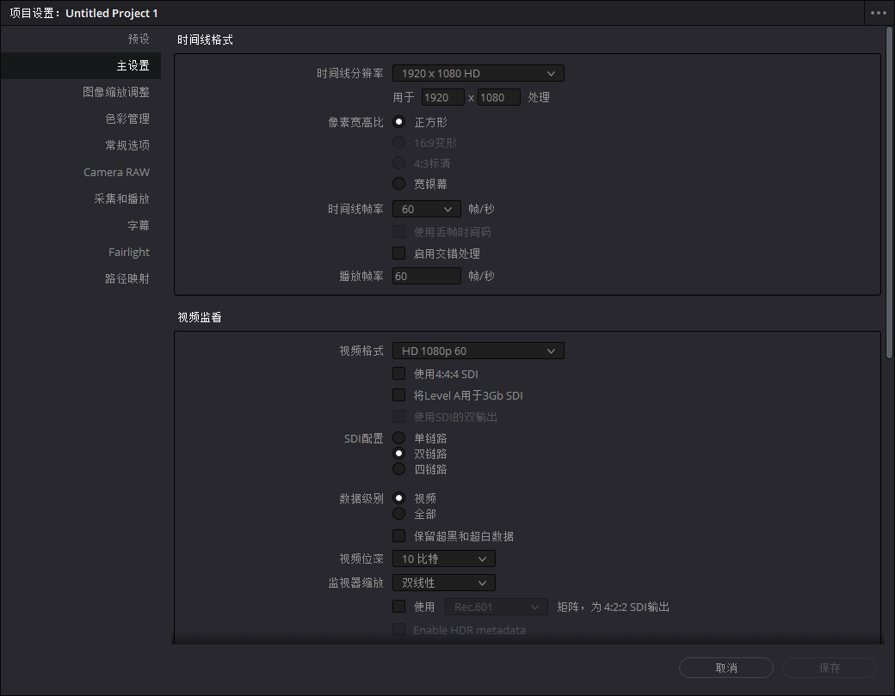
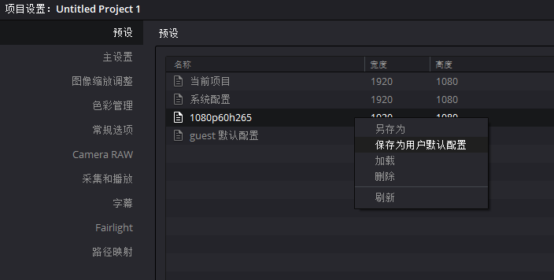
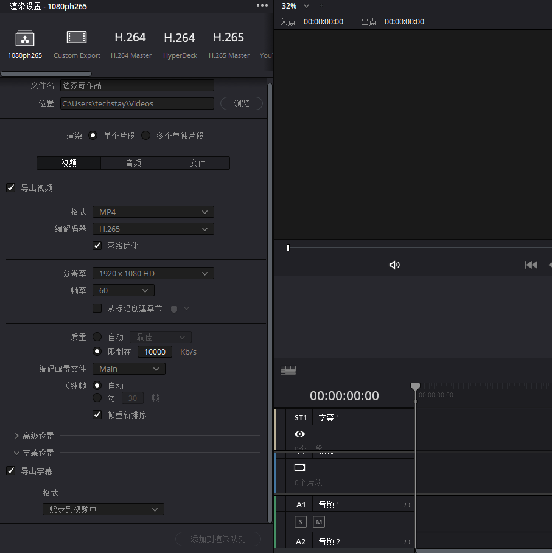

# DaVinci 达芬奇

## 教程

视频教程

- [影视飓风教程](https://www.bilibili.com/video/BV1B7411A7M1)
- [调色教程](https://www.bilibili.com/video/BV1E7411L7Wu)
- [环宇教程](https://www.youtube.com/watch?v=LaLstVhsK7I&list=PLw4hWepHFqhQpa8tvy424hML2Yk_W-mZ9)

快捷键 <https://www.jianshu.com/p/09f8a629665e>

## 配置

### 系统配置

打开达芬奇软件，创建未命名项目，进入软件本体。选择菜单的*DaVinciResolve -> 偏好设置*，打开设置对话框，做以下设置。

- _用户->项目保存和加载_，勾选*实时保存*和*项目备份*(毕竟没有人想着做了大半天从头再来吧)

部分设置需要重启达芬奇才能生效。

### 创建项目模板

#### 预设

每次新建项目，都需要重新设置一遍东西。更好的办法是先创建一个空项目作为项目模板，之后就可以通过复制模板项目的方式快速创建项目内容。

新建一个项目作为模板，起名*项目模板*，然后打开项目，点击右下角齿轮图标。按下图进行设置。

采集和播放分类下，也记得修改视频格式。字母分类下设置最小时长为 5 秒。

经常使用一套配置的话，也可以保存到预设中，下次可以直接使用，还可以直接保存为用户默认配置。下次就可以自动套用。

#### 剪辑

在达芬奇主窗口中，点击剪辑分类，新建一条空白时间线。然后在视频轨道上右键点击，创建一条字幕轨道。先选中字幕轨道，然后在达芬奇右上角的检查器中就可以设置字幕的样式，我将字幕字体设置完思源黑体，颜色为白色，加了 1 像素的黑色边框，字幕高度设为 116 左右，默认的 216 感觉太高了。

#### 交付

在达芬奇主创口中，点击交付分类，在左边可以选择渲染设置，也可以自定义渲染设置，可以将自己的自定义设置命名并保存。

有需要的话，还可以继续编辑配置，配置完毕后保存为模板项目。下次需要创建新项目的时候，先打开模板项目，然后另存为并设置一个新名称，这样可以极大的提高工作效率。
